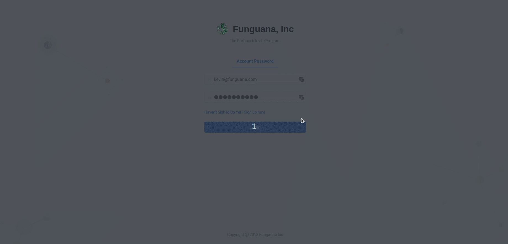

# Referral Application React.js


After working around dependency issues for this application, the react end is finally being developed. It's made using `Ant Design Pro`. The way you make necessary modications to the application is through changing the URLs in the `services/user.js` file.


## How to start

```
yarn install
```

To run the dev environment use the command:

```
yarn start
```

That should get you started. More documentation will come at some point. We'll need to include everything you'll need to change to get you  a personally branded site.


**DO NO MESS WITH THE DEPENDENCIES RIGHT NOW**
Some are old, and are therefore fragile. This is a relatively old application that's finally being open sourced.


Application Gif:

